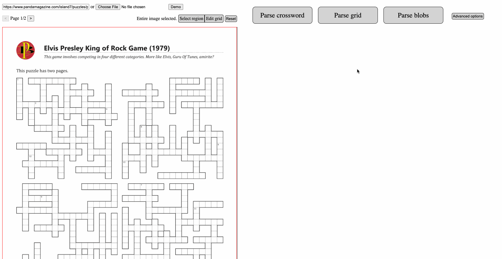
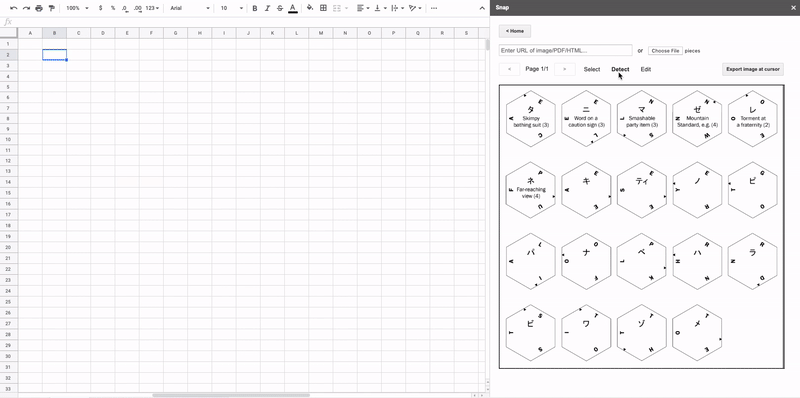

Snap
====

Snap provides advanced tooling for puzzle hunts. Try Snap at [util.in](https://util.in), or follow the instructions [here](#install-add-on) to install the add-on and use Snap directly in Google Sheets.

Features
--------

### Crossword tool

Given an image of a crossword, Snap can hook up your Google Sheet so that filling in a clue answer automatically fills in the grid and orthogonal clues.

### Parse grids

Snap can handle many types of images. For example, here is an image of a grid with borders:

### Parse blobs

Easily import jigsaw pieces or other moving components into Google Sheets.

### [Heavy duty anagram solver](https://util.in/solver.html)

Snap has a powerful solver engine with a deep understanding of English. This allows it to solve for phrases and even sentences, which traditional tools cannot do.

### [Wordsearch solver](https://util.in/wordsearch.html)

Find words in a grid. Both straight words and boggle mode are supported.

Install add-on
--------------

- Go to <https://gsuite.google.com/marketplace/app/snap_functions/556464546174> and click INSTALL.
- In the "This app isn't verified" screen, click "Advanced" -> "Go to Snap functions (unsafe)", and click "Allow".
- Visit any Google Sheet. In the "Add-ons" menu, click "Snap functions" -> "Open sidebar" to begin. The add-on also supports several one-click tools in the add-on submenu, as well as the custom functions listed [here](google-sheets-add-on/Code.js).

Development
-----------

Snap consists of three components, each corresponding to a top-level folder. Click on each folder to view a README with more details.
- [google-sheets-add-on](google-sheets-add-on): the code for the Google Sheets add-on.
- [snap-python](snap-python): functions that can be quickly run in Python, e.g. `anagram('hnopty')`.
- [snap-server](snap-server): the main Java Dropwizard server, used for all server-side logic and heavy-duty computations.

### Wikinet

The Wikinet is an indexed store of all Wikipedia article titles and summaries.

To generate the Wikinet, go to the [snap-server](snap-server) directory and run `./gradlew generateWikinet`. Note that this needs to download about 50 files of about 20GB data total (~150GB uncompressed), so may take many hours.

After the Wikinet is generated, you can call the useful `find(title)` API that returns a list of Wikipedia summaries for the given title. This means it is possible to perform primitive word association; for example, suppose you needed to find a philosophy that is a 9-letter word beginning with A. You could perform an efficient search for a Wikipedia summary containing the word "philosophy" (e.g. ANARCHISM).

