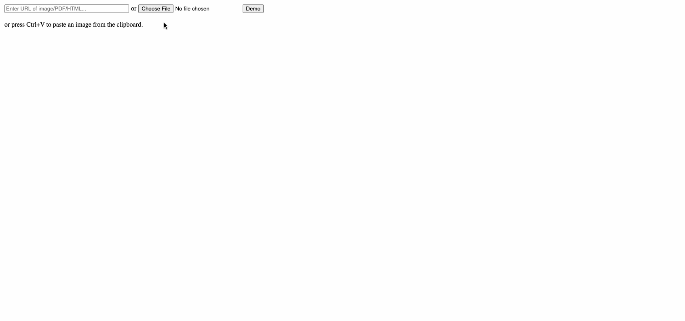

Snap
====

Snap provides advanced tooling for puzzle hunts. Try Snap at [util.in](https://util.in).

Features
--------

### [Crossword tool](https://util.in/parser)

Given a crossword puzzle page, Snap automatically detects the crossword grid and clues.

Snap then hooks up your Google Sheet so that filling in a clue answer automatically fills in the grid and letters in orthogonal clues.

### [Parse grids](https://util.in/parser)

Snap can handle many types of images. For example, here is an image of a grid with borders:

### [Parse blobs](https://util.in/parser)

Easily import jigsaw pieces or other moving components into Google Sheets.

### [Heavy duty anagram solver](https://util.in/solver)

Snap has a powerful solver engine with a deep understanding of English. This allows it to solve for phrases and even sentences, which traditional tools cannot do.

### [Wordsearch solver](https://util.in/wordsearch)

Find words in a grid. Both straight words and boggle mode are supported.

Instructions
------------

Instructions for the crossword tool [here](../../wiki/Crossword-tool-tutorial).

Instructions for parsing grids and blobs are similar to that of the crossword tool; instead of clicking "Parse crossword", choose "Parse grid" or "Parse blobs".

Instructions for the anagram solver [here](../../wiki/Heavy-duty-anagram-solver).

Snap also comes with a Google Sheet add-on for advanced users. You can find instructions for installing it [here](../../wiki/Google-Sheet-add-on).
