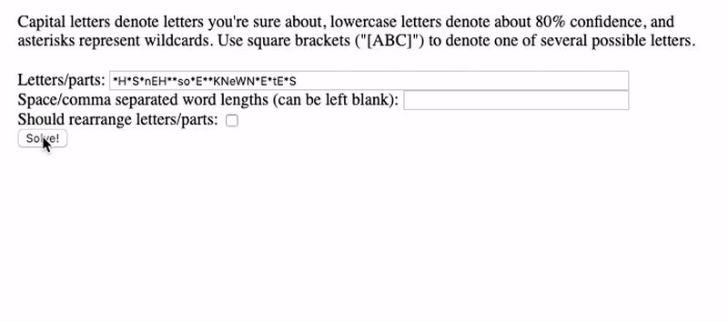

Snap
====

Snap provides tooling for puzzle hunts. Try Snap at [util.in](https://util.in).

Features
--------

### Grid and crossword parser

Given an uploaded image or PDF containing a grid, Snap can determine where the grid lines are, extract the colors, borders, and text of each grid square, and export all of the information directly into a Google Sheet, saving hours of tedious data entry time. In addition, if the grid is a crossword, Snap will hook up the Google Sheet so that filling in one clue answer will automatically fill in the letters in the grid and orthogonal clues.

### Heavy duty anagram solver

Snap uses a powerful solver engine that takes advantage of English word and bi-word frequencies (inspired on Rob Speer's [cromulence measure](https://github.com/rspeer/solvertools)). This allows it to anagram long phrases and even sentences, which traditional anagramming tools such as [I, Rearrangement Servant](https://wordsmith.org/anagram/) simply cannot do.

### Wordsearch solver

Given a grid of letters, Snap shows a simple UI with a list of words that are highlighted in the grid on hover. The tool doesn't require knowing which words to search for. The visual aspect is much clearer than other tools that only show the positions of the words in text format.

Development
-----------

The codebase consists of three top level folders. `snap-server` contains the main Java Dropwizard server, and there are also light helper functions in Python (`snap-python`) and custom functions for Google Sheets (`snap-app-scripts`).

### Snap Server

To develop on and run the Snap server, you need JDK 8+.

- Go to the `snap-server` directory.

- Create a Google API [service user](https://cloud.google.com/docs/authentication/production#providing_credentials_to_your_application) and add a `google-api-credentials.json` file with the service user's account credentials.

- Update the `config.yml` configuration file with the socket address that the Snap server will run at. If you are developing locally, you can leave the default value of `localhost:8080`.

- Update the `gradle.properties` configuration file with your platform, one of `linux-x86_64`, `macosx-x86_64`, or `windows-x86_64`.

- Download required files by running `./gradlew downloadFiles`.

- Start the Snap server by running `./gradlew run`.

- Visit the app at `http://localhost:8080`, or whatever address your server is hosted at.

You can develop on Snap by running `./gradlew eclipse` and then importing "Existing Projects into Workspace" in Eclipse. Files are in the standard Java project layout, with the entry point at `src/main/java/com/kyc/snap/server/SnapServer.java` and web assets under `src/main/resources/assets`.

### Wikinet

The Wikinet is an indexed store of all Wikipedia article titles and summaries.

To generate the Wikinet, go to the `snap-server` directory and run `./gradlew generateWikinet`. Note that this needs to download about 50 files of about 20GB data total (~150GB uncompressed), so may take many hours.

After the Wikinet is generated, the methods in the `Wikinet.java` file and the Python `wikinet` functions can be used.

### Python

To use Snap's Python functions, add the following to your `.bashrc`:

    export PYTHONPATH=/path/to/snap2/snap-python
    alias snap='PYTHONSTARTUP=/path/to/snap2/snap-python/bootstrap.py python'

You can then access the functions anywhere:

    $ python
    >>> from wikinet import find
    >>> wikinet.find('Ajaigarh')
    set([Article(title='Ajaigarh', redirect=None, summary='Ajaigarh or Adjygurh is a town and a nagar panchayat in the Panna District of Madhya Pradesh state in central India.\n')])

Or, start a Python console with the functions already boostrapped:

    $ snap
    >>> find('Ajaigarh')
    set([Article(title='Ajaigarh', redirect=None, summary='Ajaigarh or Adjygurh is a town and a nagar panchayat in the Panna District of Madhya Pradesh state in central India.\n')])

