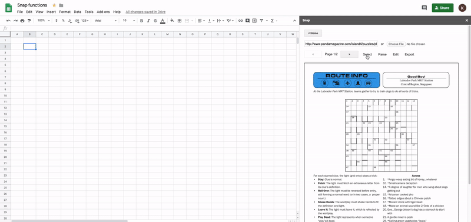
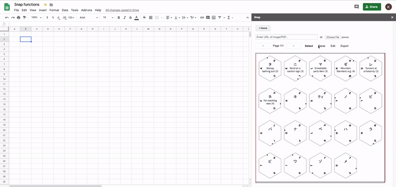
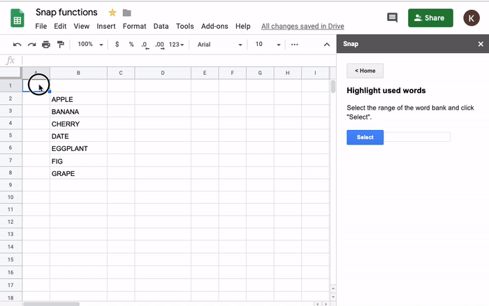
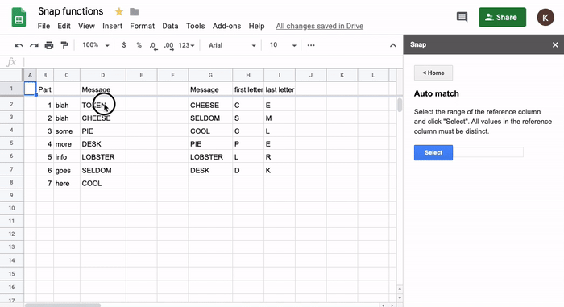
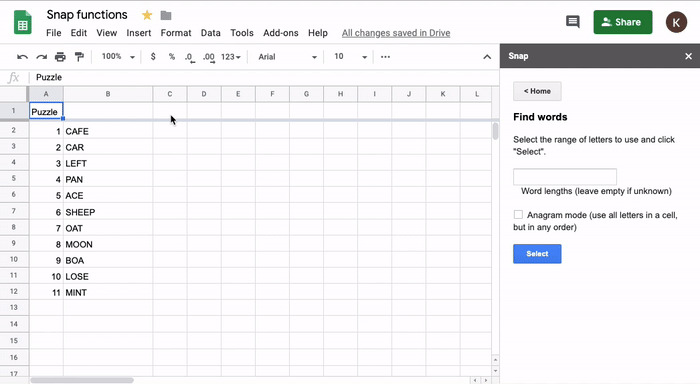

Snap
====

Snap provides tooling for solving puzzles.

## Features

### Parse crosswords

Upload an image of a crossword, and Snap will format it in Google Sheets. Enter the crossword clues as well, and Snap will hook up the answer spaces so that they automatically fill in the grid and orthogonal clues!

### Parse grids

Snap can parse other types of grids as well. For example, here is a grid with borders:

### Parse blobs

Snap provides an easy way to copy jigsaw pieces or other moving components into transparent movable pieces in Google Sheets.

### Word bank

Select a region in Google Sheets as a word bank. Used words will be automatically shaded.

### Rearrange rows to match

Suppose you have two sets of data in Google Sheets and you need to match them by a column. Snap provides an easy way to do this:

### Find words

Snap has a powerful word solver. It uses cromulence analysis and word associations to find more promising solutions than Onelook or Nutrimatic.

## Install Snap

Find Snap in the [GSuite Marketplace](https://gsuite.google.com/marketplace/app/snap_functions/556464546174). Click INSTALL. Then, in any Google Sheet, click "Add-ons" -> "Snap functions" -> "Open sidebar". As a one-time action, you will need to allow Snap access to your Google Sheets.

Snap does not store any personal information.

Development
-----------

The codebase consists of three top level folders. [snap-server](snap-server) contains the main Java Dropwizard server, and there are also light helper functions in [snap-python](snap-python) and custom functions for Google Sheets in [snap-apps-script](snap-apps-script).

### Snap Server

To develop on and run the Snap server, you need JDK 8+.

- Go to the [snap-server](snap-server) directory.

- Snap requires a Google API service user in order to edit Google Drive documents. To create a new service user, visit the [Google Cloud Platform](https://console.cloud.google.com/home) and create a project. In the "IAM & admin" tab, select "Service accounts" and click "Create service account". You can use "sheets-creator" as the name. Note the service account ID; this is the email address that you must share your Google Sheets with to use Snap.

- Download a credentials file for the service account. Click "Create key" and download the JSON file. Name it `google-api-credentials.json` and save it in the [snap-server](snap-server) directory.

- Allow the service user to use Google Drive APIs. In the navigation menu of the Google Cloud console page, select "APIs & Services" and click "Enable APIs and services". Enable both the Google Drive API and Google Sheets API.

- Adding images is currently only supported in Apps Script and not in the Google Sheets API. The current workaround is to create a new [script](http://script.google.com) and copy the contents of [WebApp.gs](snap-apps-script/WebApp.gs), but with the value of `SERVICE_USER` at the top renamed as appropriate. Then, in the "Publish" menu, click "Deploy as web app" and select "Execute the app as:" yourself instead of the user accessing. A popup dialog will display the URL of the published web app; it looks like `https://script.google.com/macros/s/.../exec`. Copy the URL into the `googleServerScriptUrl` field in the [server.properties](snap-server/server.properties) file. Finally, in the "Run" menu, run any function and click through the Google popup to allow the script to be run.

- Update the [gradle.properties](snap-server/gradle.properties) configuration file with your platform, one of `linux-x86_64`, `macosx-x86_64`, or `windows-x86_64`.

- Download required data files by running `./gradlew downloadFiles`.

- Start the Snap server by running `./gradlew run`.

- Visit the app at `http://localhost:8080`, or whatever address your server is hosted at.

You can develop on Snap by running `./gradlew eclipse` and then importing "Existing Projects into Workspace" in Eclipse. Files are in the standard Java project layout, with the entry point at [SnapServer.java](snap-server/src/main/java/com/kyc/snap/server/SnapServer.java) and web assets under [assets](snap-server/src/main/resources/assets).

### Wikinet

The Wikinet is an indexed store of all Wikipedia article titles and summaries.

To generate the Wikinet, go to the [snap-server](snap-server) directory and run `./gradlew generateWikinet`. Note that this needs to download about 50 files of about 20GB data total (~150GB uncompressed), so may take many hours.

After the Wikinet is generated, the methods in the [Wikinet.java](snap-server/src/main/java/com/kyc/snap/wikinet/Wikinet.java) file and the Python [wikinet](snap-python/wikinet.py) functions can be used.

### Python

To use Snap's Python functions, add the following to your `.bashrc`:

    export PYTHONPATH=/path/to/snap2/snap-python
    alias snap='PYTHONSTARTUP=/path/to/snap2/snap-python/bootstrap.py python'

You can then access the functions anywhere:

    $ python
    >>> from wikinet import find
    >>> wikinet.find('Ajaigarh')
    set([Article(title='Ajaigarh', redirect=None, summary='Ajaigarh or Adjygurh is a town and a nagar panchayat in the Panna District of Madhya Pradesh state in central India.\n')])

Or, start a Python console with the functions already boostrapped:

    $ snap
    >>> find('Ajaigarh')
    set([Article(title='Ajaigarh', redirect=None, summary='Ajaigarh or Adjygurh is a town and a nagar panchayat in the Panna District of Madhya Pradesh state in central India.\n')])

Hunt Dashboard
--------------

The following [template](https://docs.google.com/spreadsheets/d/1RDu12f795VzK5beceMhsV4Q2kIRzxHWX06fK5-buv94) can be copied to create a lightweight hunt dashboard directly in Google Sheets. This allows you to see a list of puzzle URLs and spreadsheet URLs in one place, and allows you to organize them using all of Google Sheets functionality for free. Furthermore, the template supports the following features:

- Entering the URL of a puzzle will trigger a popup dialog to automatically generate a Google Sheet, autocomplete the "Title" column, and create a Slack channel with all members of your team.

- Entering the answer to a puzzle will trigger a popup dialog to automatically rename the corresponding Google Sheet and notify the Slack channel for the puzzle.

To create a dashboard:

1. Go to the [template](https://docs.google.com/spreadsheets/d/1RDu12f795VzK5beceMhsV4Q2kIRzxHWX06fK5-buv94) and in the File menu, click "Make a copy...". Choose an empty parent folder that can be shared with the Snap service user. The name of the sheet should be the name of the puzzle hunt.

1. In the "Tools" menu, click "Script editor" to open the "Hunt Dashboard script". If the script doesn't appear, you can copy the contents from [here](snap-apps-script/Dashboard.gs).

1. If you want to enable Slack integration, create a new Slack app [here](https://api.slack.com/apps). In the "OAuth & Permissions" section, add the following permission scopes to your app: `channels:write`, `users:read`, `users:read.email`, `team:read`, and `chat:write:bot`. Install the app to your workspace, and copy the "OAuth Access Token" to the `SLACK_TOKEN` field in the Hunt Dashboard script.

1. Enter email addresses of any other members that should be invited to each newly created Slack channel in the `SLACK_EMAIL_ADDRESSES` field. Don't include yourself (the person who created the Slack app); you will already be invited to every channel.

1. In the "Run" menu and "Run function" submenu of the Hunt Hashboard script, click "setup". This will share the entire parent folder with the Snap service user, and install the triggers to automatically show popups.

1. Enter a puzzle URL in the first column of the dashboard to begin!

